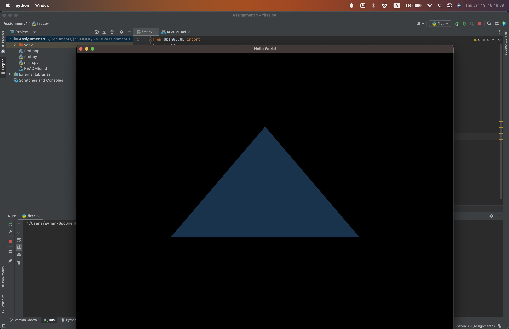
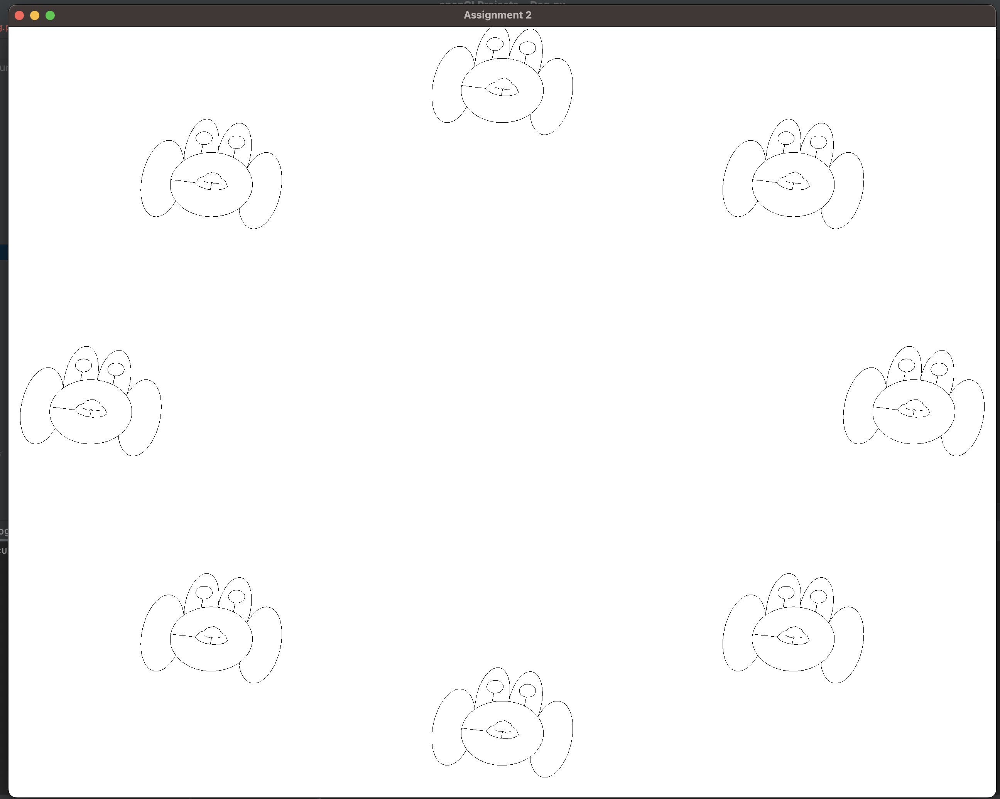
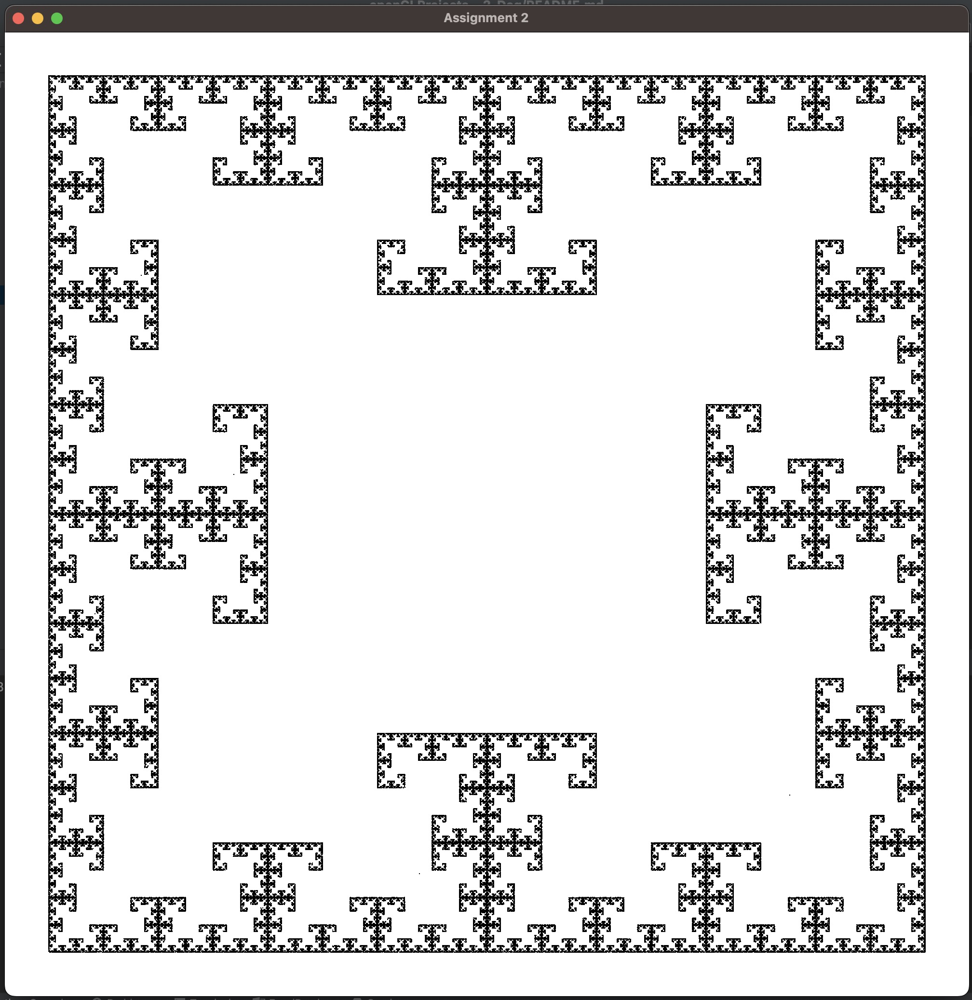
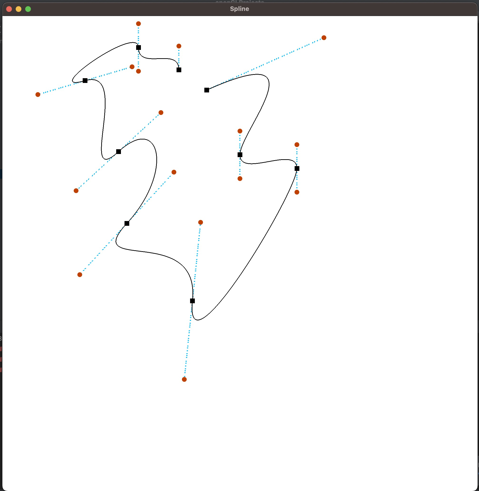
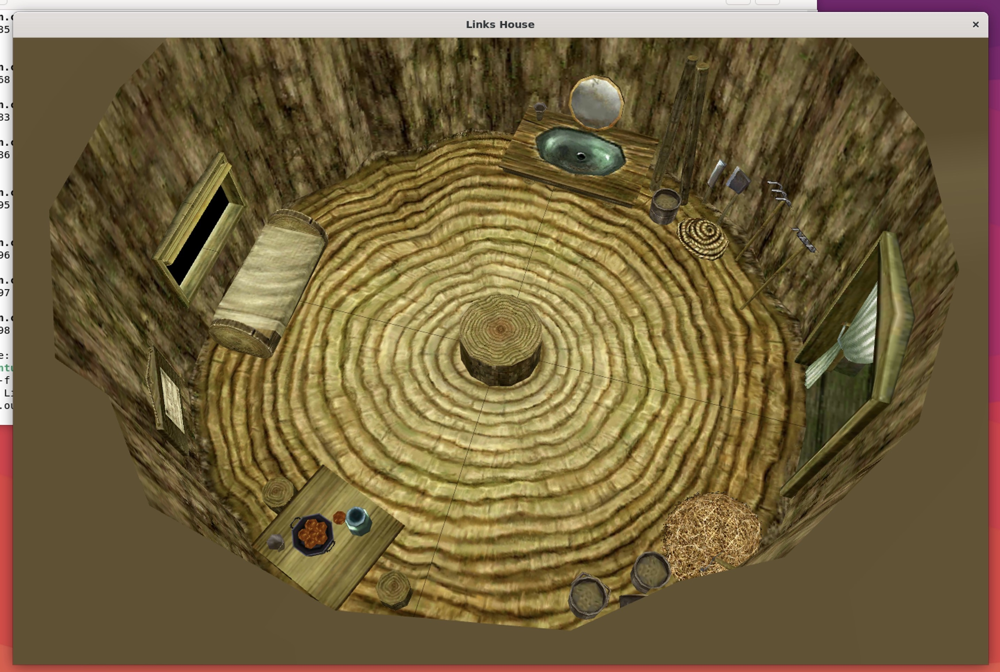
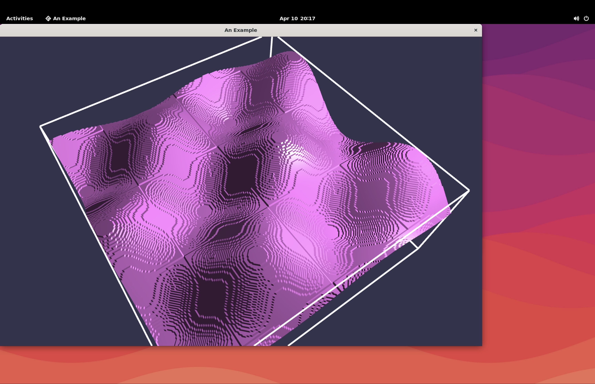

# openGLProjects

Projects created using the OpenGL library during Computer Graphics 3388 at Western University.
  
See each folder's README for details on each one

<figure>

<figcaption align="center"><b>Triangle</b></figcaption>
</figure>

<figure>

<figcaption align = "center"><b>Dog Animation</b></figcaption>
</figure>

<figure>

<figcaption align = "center"><b>Fractal</b></figcaption>
</figure>

<figure>

<figcaption align = "center"><b>Spline Editor</b></figcaption>
</figure>

<figure>

<figcaption align = "center"><b>Links House</b></figcaption>
</figure>

<figure>

<figcaption align = "center"><b>Marching Wave</b></figcaption>
</figure>

[//]: # (<figure>)

[//]: # ()

[//]: # (<figcaption align = "center"><b>Marching Cubes</b></figcaption>)

[//]: # (</figure>)

<figure>

<figcaption align = "center"><b>Waves</b></figcaption>
</figure>

<figure>

<figcaption align = "center"><b>Waves Wireframe</b></figcaption>
</figure>